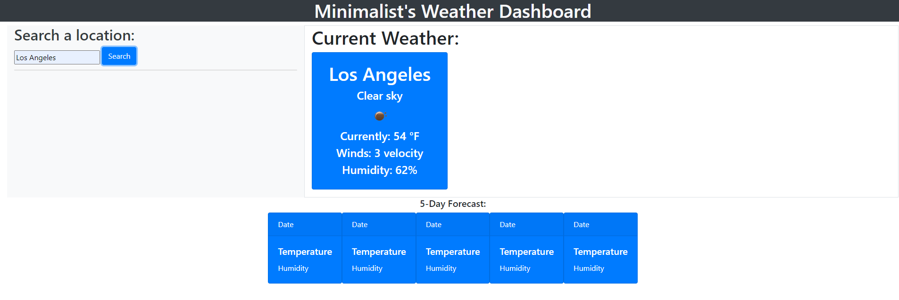

# Minimalist's Weather Dashboard!

## Deployed Application

**Live Deployment**: https://jwilferd10.github.io/Weather-Dashboard/

**Github Repository**: https://github.com/jwilferd10/Weather-Dashboard

## Screenshot of Deployed Application

## Description:
This application uses openweathermap.org's current day weather forecast to display current conditions on the searched city. When I had first started learning how to code, this particular challenge gave me the most trouble. I didn't know what I was doing wrong and I was spooked to touch it. Many weeks later I decided to come back to this project and at least get ONE thing working. Having scrapped the original code I finally got it to display current weather conditions! There's definitely more to come once I've got more time. I'd like to add a five-day-forecast to this and put more code into this.
  
## User Story
- AS A traveler
    - I WANT to see the weather outlook for multiple cities
    - SO THAT I can plan a trip accordingly

- GIVEN a weather dashboard with form inputs
    - WHEN I search for a city
        - THEN I am presented with current and future conditions for that city

## Usage:
   - Enter desired location!
  
  ## Contact Information:
  - Github: [jwilferd10](https://github.com/jwilferd10)
  - Email: jwilferd10@yahoo.com 
